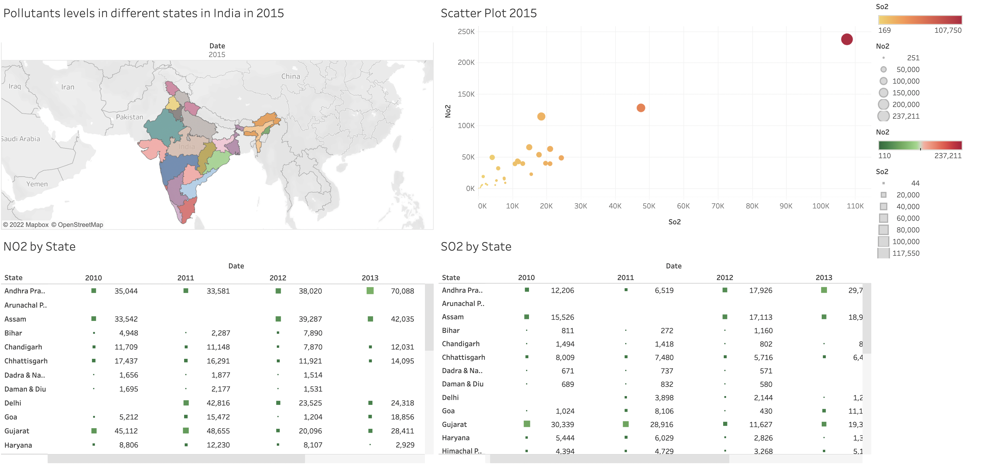

# Air Pollution Level Dashboard

## Overview
Following is Tableau Dashboard representing air pollution levels in different states of India.

## Description
India is currently the second most polluted nation in the world. In comparison to what it would be if the World Health Organization (WHO) recommendation were followed, air pollution reduces the typical Indian's life expectancy by 6.3 years; in comparison to what it would be if pollution were lowered to meet the nation's own national standard. Air pollution reduces lifespans in Delhi and the surrounding area by more than 10 years, making some regions of India far worse off than the national average.

In this research, I have used data on air pollution in India to analyse it and determine which states are affected the most. I have visualized the data using Tableau.

## [Dashboard](https://public.tableau.com/app/profile/aakansha.goyal/viz/AirPollutionLevelofIndia/Dashboard1)

### [Source](https://www.kaggle.com/datasets/shrutibhargava94/india-air-quality-data)

